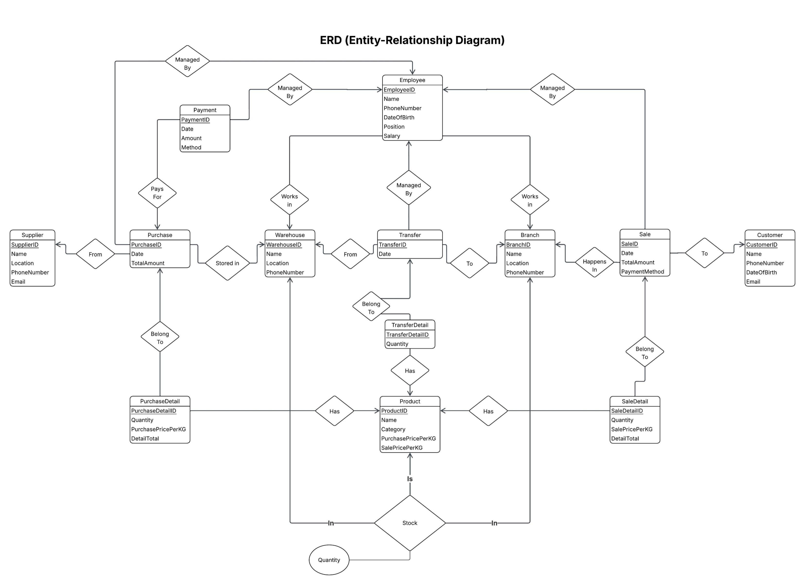
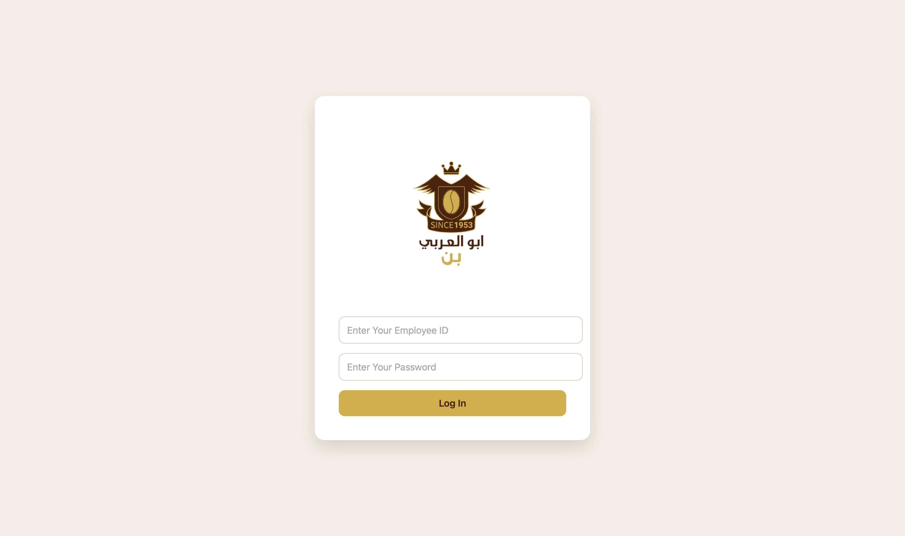
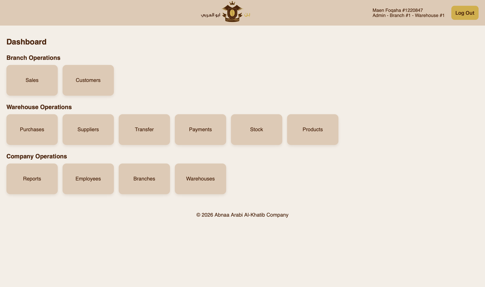
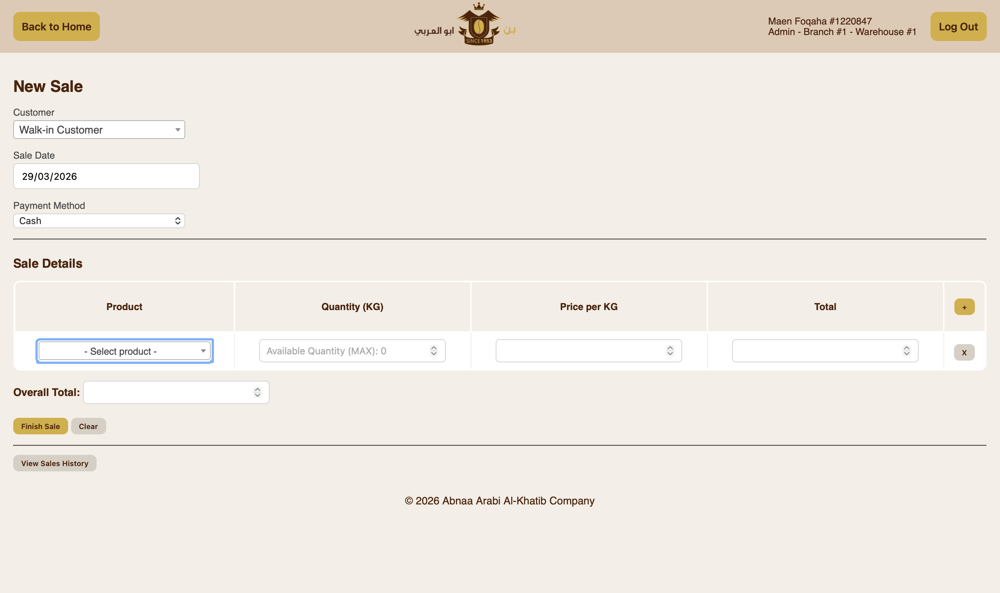
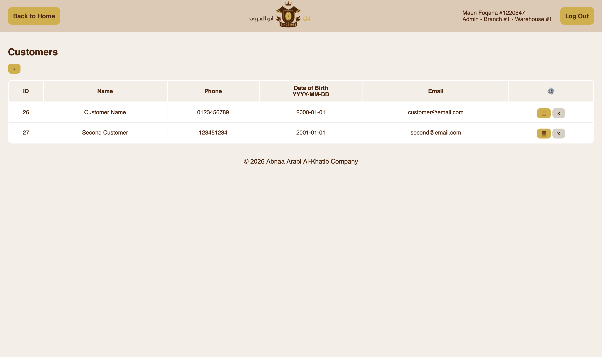
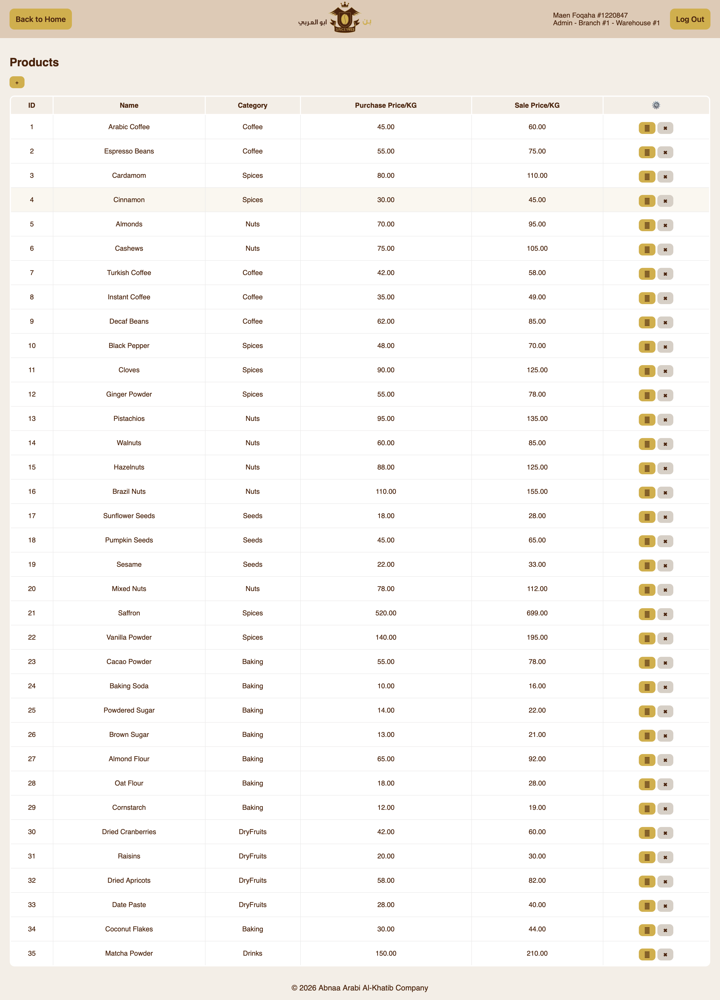
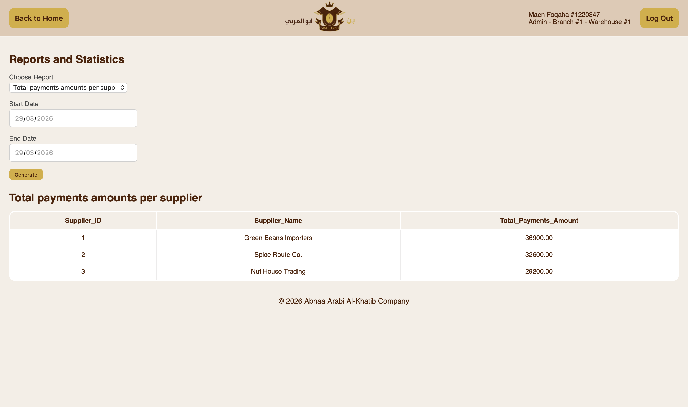
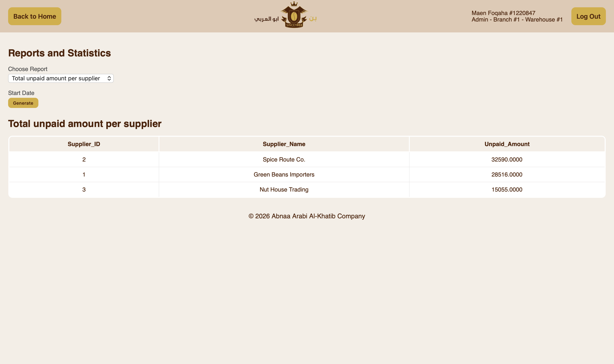

# Store Operations Management System

A web-based retail operations management system built with **Flask** and **MySQL**. The system manages the full business workflow connecting suppliers, warehouses, branches, and customers — covering purchases, inventory, transfers, sales, payments, and reporting.

---

## Table of Contents

- [System Workflow](#system-workflow)
- [Features](#features)
- [Technology Stack](#technology-stack)
- [Database Entities](#database-entities)
- [Access Levels](#access-levels)
- [Modules](#modules)
- [Reports](#reports)
- [Project Structure](#project-structure)
- [Setup](#setup)
- [ER Diagram](#er-diagram)
- [Screenshots](#screenshots)

---

## System Workflow

Products move through the system in the following order:

```
Supplier → Warehouse → Branch → Customer
```

Employees manage each stage of this flow. Warehouse employees handle purchases and transfers; branch employees handle sales; admins have full access across the system.

---

## Features

- Role-based access control (admin vs. standard employee)
- Full CRUD for all core entities with soft-delete and recovery
- Purchase tracking with partial payment support
- Stock transfers from warehouses to branches
- Sales recording at the branch level
- Real-time warehouse and branch stock monitoring
- 20 built-in visual and tabular business reports
- Responsive web interface with Jinja2 templating

---

## Technology Stack

| Layer | Technology |
|---|---|
| Backend | Python 3, Flask |
| Database | MySQL |
| Frontend | HTML, CSS, JavaScript |
| Templating | Jinja2 |
| DB Connector | mysql-connector-python |

---

## Database Entities

The system is built around the following relational database tables:

- `warehouse` — physical storage locations
- `branch` — retail branches that sell to customers
- `employee` — staff with assigned warehouse or branch and access level
- `supplier` — vendors that supply products
- `product` — items with purchase and sale prices per kg
- `customer` — registered customers (optional on sales)
- `purchase` / `purchase_detail` — supplier orders and their line items
- `sale` / `sale_detail` — customer transactions and their line items
- `transfer` / `transfer_detail` — stock movements from warehouse to branch
- `payment` — payments made against supplier purchases
- `warehouse_stock` — current stock levels per product per warehouse
- `branch_stock` — current stock levels per product per branch

---

## Access Levels

| Feature | Standard Employee | Admin |
|---|---|---|
| View own sales | ✅ | ✅ |
| Add sales | ✅ | ✅ |
| Edit / delete sales | ❌ | ✅ |
| View purchases | ✅ (own warehouse) | ✅ (all) |
| Add purchases | ✅ | ✅ |
| Edit / delete purchases | ❌ | ✅ |
| Manage transfers | ✅ (own warehouse) | ✅ (all) |
| Manage payments | ❌ | ✅ |
| Manage employees | ❌ | ✅ |
| View reports | ❌ | ✅ |
| Manage products / branches / suppliers | ❌ | ✅ |

---

## Modules

### Purchases
Records products bought from suppliers and adds them to warehouse stock. Supports editing and soft-deletion with full stock reversal. Recovery is blocked if warehouse stock is insufficient.

### Transfers
Moves stock from a warehouse to a retail branch. Edits and deletions check that branch stock has not already been partially sold before reversing.

### Sales
Records customer purchases at a branch. Optionally links to a registered customer. Reduces branch stock on save and restores it on deletion or edit.

### Payments
Tracks payments made to suppliers against specific purchases. Supports partial payments, multiple payment methods, and soft-deletion. Displays remaining balance per purchase.

### Stock
Displays current stock across all warehouses and branches. Filterable by warehouse or branch. Non-admin employees see only their own location.

### Customers
Manages customer profiles including name, phone, date of birth, and email. Used optionally when recording sales.

### Suppliers
Manages supplier profiles. Soft-deleted suppliers are hidden from active lists but preserved in purchase history.

### Employees
Manages employee accounts including assigned location (warehouse or branch), salary, position, access level, and login password. Default password is set to the employee's phone number.

### Products
Manages products with category, purchase price per kg, and sale price per kg. Soft-deleted products are excluded from new purchases, transfers, and sales.

### Branches / Warehouses
Manage the physical locations used across the system.

---

## Reports

The system includes 20 configurable reports filterable by date range. Chart types include bar, line, pie, and table.

| # | Report | Type |
|---|---|---|
| 1 | Total income per branch | Bar |
| 2 | Number of sales per branch | Bar |
| 3 | Average sale amount per branch | Bar |
| 4 | Daily sales amount for a chosen branch | Line |
| 5 | Number of sales by employee | Table |
| 6 | Total revenue per product | Table |
| 7 | Sales by product category | Pie |
| 8 | Total spending per registered customer | Table |
| 9 | Total payments per supplier | Table |
| 10 | Outstanding balance per supplier | Table |
| 11 | Total purchase value per warehouse | Bar |
| 12 | Number of purchases per warehouse | Bar |
| 13 | Total purchased amount per supplier | Table |
| 14 | Average purchase value per supplier | Bar |
| 15 | Payment method distribution | Pie |
| 16 | Number of transfers per branch | Bar |
| 17 | Total quantity transferred per branch | Bar |
| 18 | Top transferred products by quantity | Table |
| 19 | Out-of-stock products at warehouses | Table |
| 20 | Out-of-stock products at branches | Table |

---

## Project Structure

```
.
├── app.py                  # Main Flask application
├── static/
│   ├── style.css
│   └── images/
├── templates/
│   ├── login.html
│   ├── home.html
│   ├── sales.html
│   ├── sales_form.html
│   ├── sales_view.html
│   ├── sales_deleted.html
│   ├── purchases.html
│   ├── purchases_form.html
│   ├── purchases_view.html
│   ├── customers.html
│   ├── customers_form.html
│   ├── suppliers.html
│   ├── suppliers_form.html
│   ├── suppliers_deleted.html
│   ├── employees.html
│   ├── employees_form.html
│   ├── employees_deleted.html
│   ├── branches.html
│   ├── branches_form.html
│   ├── branches_deleted.html
│   ├── warehouses.html
│   ├── warehouses_form.html
│   ├── stock.html
│   ├── transfer.html
│   ├── transfer_form.html
│   ├── transfer_view.html
│   ├── payments.html
│   ├── payment_view.html
│   └── reports.html
└── __docs/
    ├── erd.png
    ├── Login.png
    ├── Home.png
    ├── Sales.png
    ├── Customers.png
    ├── Products.png
    ├── Reports0.png
    └── Reports.png
```

---

## Setup

1. **Clone the repository**

```bash
git clone https://github.com/M4EN/store-operations-management-system.git
cd store-operations-management-system
```

2. **Install dependencies**

```bash
pip install flask mysql-connector-python
```

3. **Create the MySQL database**

Create a database named `salesSystem` (or your preferred name) and import your schema.

4. **Configure the database connection**

In `app.py`, update the connection block with your credentials:

```python
salesDB = mysql.connector.connect(
    host="localhost",
    user="your_username",
    passwd="your_password",
    database="salesSystem"
)
```

5. **Run the application**

```bash
python app.py
```

6. **Access the app**

Open your browser and navigate to:
```
http://127.0.0.1:5000
```

A default admin account is created automatically when you run the SQL schema:

| Field | Value |
|---|---|
| Employee ID | `1` |
| Password | `admin1234` |

---

## ER Diagram



---

## Screenshots
**Login**


**Home**


**Sales**


**Customers**


**Products**


**Reports**



---